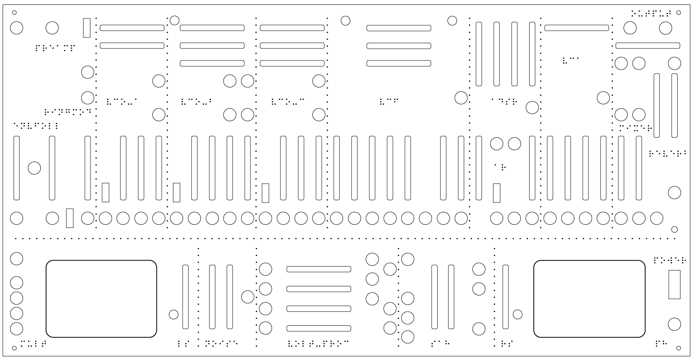
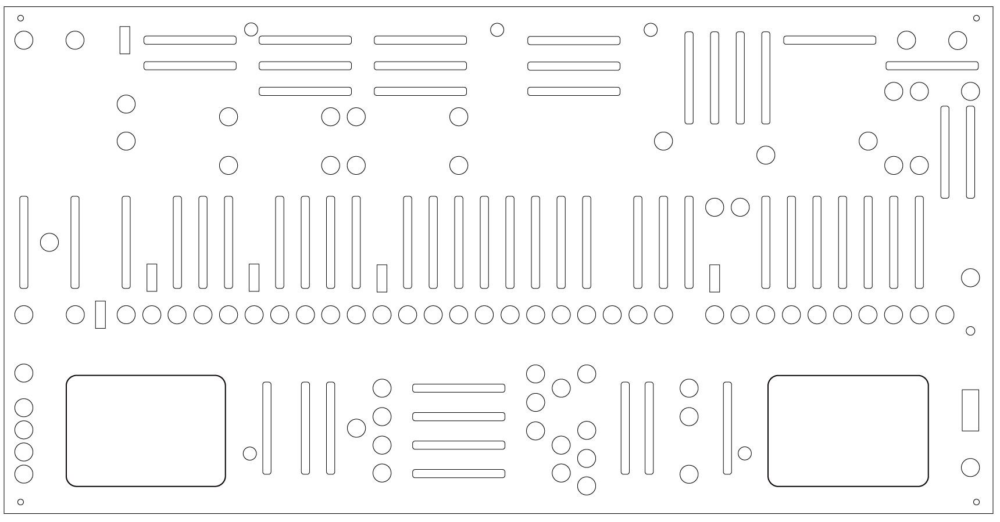
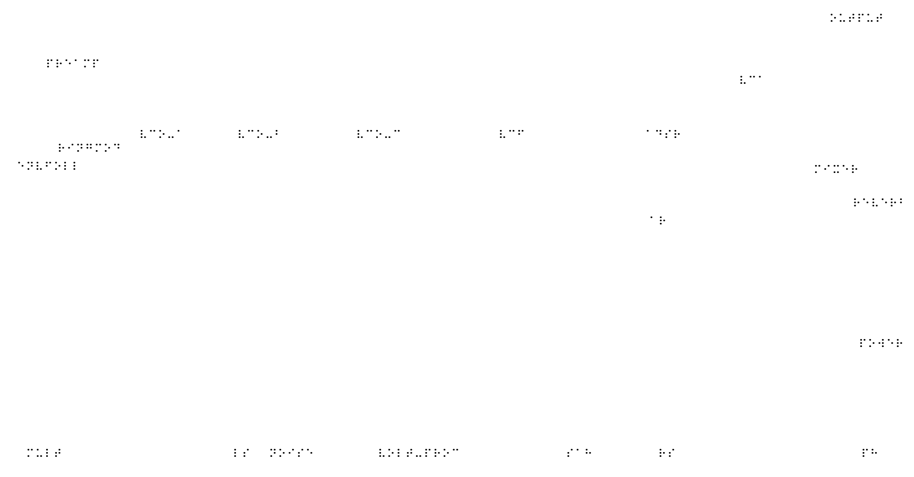
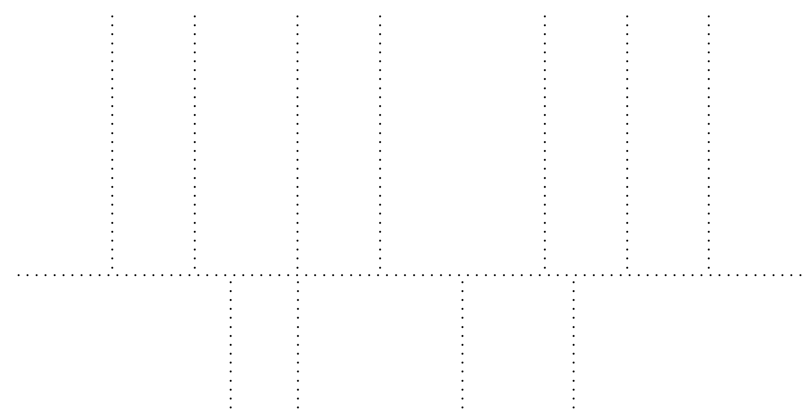
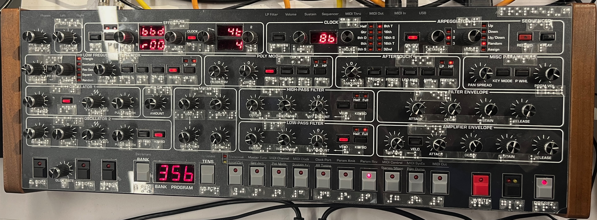
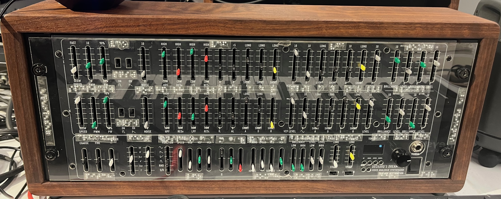
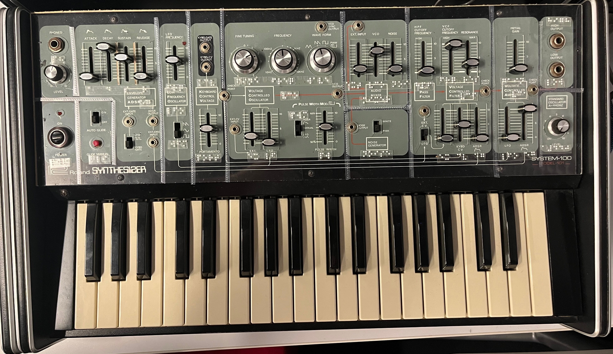
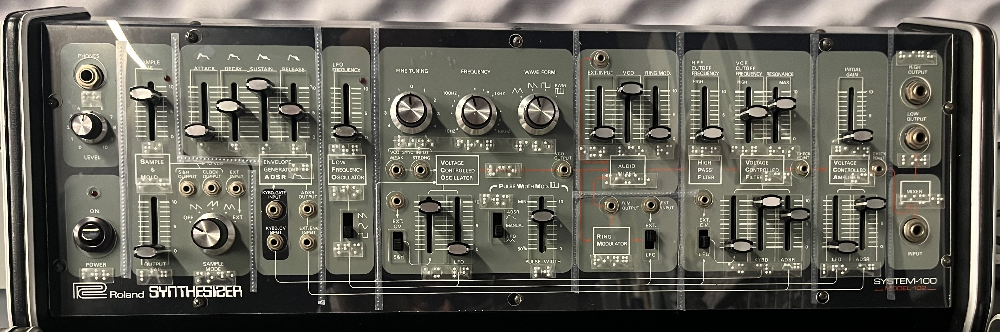
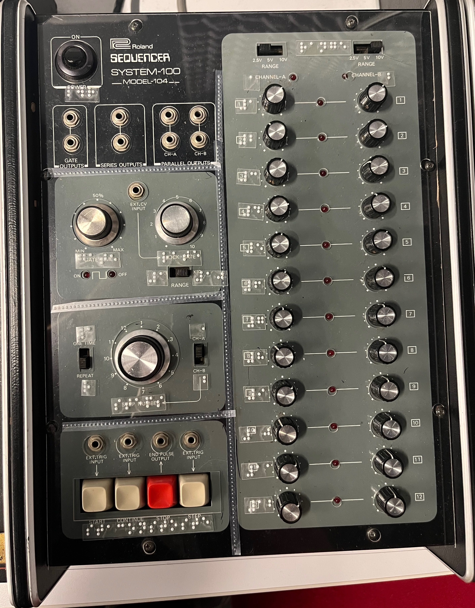
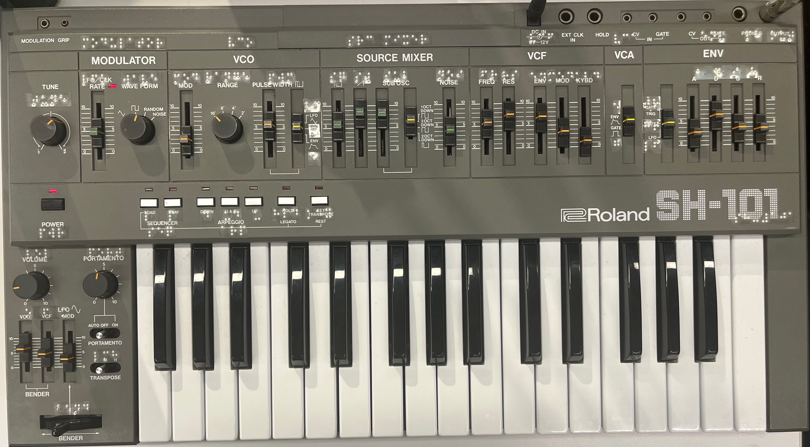

# brailleOverlays

#### brlov}lays

Part of [synthaccess](../README.md)

[ABILITY Project](http://ability.nyu.edu) / [Integrated Design & Media](http://idm.engineering.nyu.edu)   
NYU

Files:
- README.md - this file
- synths - folder containing example vector synth overlays with braille mappings
- img - folder containing example images

**brailleOverlays** is a set of design guidelines and examples for adding braille lettering to synthesizers. 

## Introduction

If your synthesizer is "one affordance per function", one of the simplest and most effective ways to add tactile accessibility for Blind / Low Vision users is to label the synthesizer with braille. Below, we outline three methods (from simple and inexpensive to somewhat complex) for doing this.

[Braille](https://en.wikipedia.org/wiki/Braille) is a [standard](https://brailleauthority.org/size-and-spacing-braille-characters) tactile writing system invented in 1824 that uses a two column by three row grid of six dots for each character. The braille system not only specifies the layout of these dots for each character in the writing system, but also defines the characters' nominal dot sizing and spacing. In other words, there's no such thing as "jumbo braille" or "mini braille". There's just braille. There are [standard mappings](https://en.wikipedia.org/wiki/International_uniformity_of_braille_alphabets) for common writing systems across the world. Languages that use logographic writing systems (such as [Chinese](https://en.wikipedia.org/wiki/Mainland_Chinese_Braille)) will use a phonetic alphabet to create a braille mapping.

Grade (or Level) 1 braille defines a [basic mapping](https://brailleaustralia.org/wp-content/uploads/2013/09/braillecharacters.pdf) for the alphabet, numbers, and punctuation. Grade 2 braille has [contractions](https://www.teachingvisuallyimpaired.com/uploads/1/4/1/2/14122361/ueb_braille_chart.pdf), leveraging context and unused characters to reduce common words, letter combinations, and syllables to fewer characters. Grade 2 braille is specific to the *language* being written (e.g. English vs. French), wherease Grade 1 braille is standardized by character set (e.g. the Roman alphabet versus Cyrillic). Free software such as [BrailleBlaster](https://www.brailleblaster.org/) can be used to convert text into braille that includes these Grade 2 contractions.

If you use Grade 2 braille, you can save space. For example, the phrase:

> "Some little children adding 2+2 might count it as 22, not 4." 

maps to...

> <bl>,"s ll *n add+ #b"6#b mi<t c.t x z #bb1 n #d4</bl>

 

This certainly saves space (46 characters instead of 61). However, a braille user who reads in another language might not be able to read it.

## Option #1: Braille tape

The simplest way to add braille to a synthesizer is to use a low cost braille labeller (such as [this one](https://www.maxiaids.com/product/reizen-rl-350-braille-labeler)) and some adhesive-backed labeling tape (such as [this](https://www.amazon.com/NineLeaf-Compatible-3D-Embossing-Organizer/dp/B0C3MGZKYH/?th=1)). You can then punch out braille labels and apply them directly to your synthesizer front panel. If you use clear labels, you can place the labels over your synthesizer. You can also create braille labels manually, using a [braille stylus](https://carroll.org/product/single-line-slate-w-stylus/) on dymo tape or any adhesive paper.

An alternative to this method is to print out sheets of braille on an embossing printer (such as [this one](https://viewplus.com/product/vp-columbia-2/#product-more-info)) using sticker paper which you then cut out and affix to the device. You can use [BrailleBlaster](https://www.brailleblaster.org/) and the [Swell Braille](https://www.ffonts.net/Swell-Braille.font.download) typeface to experiment with this method.

## Option #2: Labels on an overlay

While it's great to add labels directly to your equipment, two issues might occur. First, the synthesizer surface might not take well to adhesive labels (for example, if the face plate on the synthesizer is powder-coated). Second, you might be worried about the labels damaging your synthesizer (for example, if you have a vintage equipment where adhesives might cause wear on the visual labels underneath.

A great solution for all of this is to cut a **plexiglass overlay** for your synthesizer, and then affix the braille to the overlay. You can often make these overlays simply if you have access to a laser cutter, you can use pre-cut plexiglass (we use [0.040" clear colorless acrylic](https://www.canalplastic.com/products/clear-colorless-0-040-acrylic-sheet?variant=37615076302)) to make clear, thin sheets that can sit on top of the synthesizer's face, with holes cut in place for switches, buttons, knobs, etc.

The best overlays have ample space for all of the affordances (knobs, switches, sliders, jacks) on the synthesizer, but can still be affixed to the synth face in an easy manner. One way to do this is to add cutout points for the front panel mounting screws and make those circles small enough that you can use the screws to mounth the plexi overlay and securit it to the synth. Additionally, potentiometers often have knobs or slider caps that can be removed, so the cutout can be narrower, as it only needs to accommodate the shaft of the pot.

To make an overlay, there are a bunch of options:

1. Many commercial manufacturers provide line-art renderings of their front panels (on their websites, in PDF documentation, etc.) that can be imported into a vector design program (e.g. [Inkscape](https://inkscape.org/), Adobe Illustrator, CorelDRAW) and traced over to make a laser cuttable overlay. You can also write the manufacturer's support group and explain that you're making an accessibility overlay for one of their synths and would love a reference CAD file to work from - there's a good chance they'll help you out.
2. You can take a high resolution photograph of your synth and trace over it. Be careful for skewing / pincushioning artifacts from your camera not being face on with the synth.
3. You can use a 3D scanning app (such as Polycam or 3D Scanner App) to make a scan of your synthesizer's front panel and import it into 3D modelling software (such as [Blender](https://www.blender.org/) that knows how to export a 2D vector slice of a 3D model. 2D vector software that knows how to create slices from 3D assets (Illustrator, Inkscape) can do this as well.
4. If the synthesizer is reasonably small, you can place it face-down on a scanner (or a photocopier with a scanning function). You can then create a layer and draw cutouts for your overlay.

With any of these methods, we recommend doing a test cut first on cardboard to make sure everything fits properly. Once you've got your overlay fitted, you can add your braille adhesive labels and they should still well. As an added bonus, you now have a protective cover for your synthesizer!

## Option #3: UV Print the braille directly onto an overlay

If you're going to create an overlay for your synth, you can UV print the braille (and dividers, and any other tactile graphics) onto the acrylic directly, using a commercial UV flatbed printer. Commercial print shops will often have UV printing service; for example, in the USA, if a print shop advertises that they can do "ADA signage", then you're probably in the right place. There may be places in your community that are able to do a full-service project - they will source the acrylic, laser cut the overlay, and do the braille printing all in one go.

## Examples

The synthesizers we have created overlays for in the [IDM Audio Lab](https://idmnyu.github.io/audiolab/) are contained in the 'synths' folder of this repository as layered SVG files. 
1. The 'overlay' layer contain the laserable cutout.
2. The 'braille' layer contains braille labels in the [Swell Braille](https://www.ffonts.net/Swell-Braille.font.download) font. These labels can be made with a braile labeler, printed using an embossing printer, or directly printed onto an overlay using a UV printer.
3. The 'dividers' layer contains suggested dividers for different sections of the synthesizer. These can be made in a variety of ways; the simplest is to use the 'a' (<bl>a</bl>) letter on a braille labeller and then turn the tape to the correct orientation. As with the above, you can also directly print this onto an overlay using a UV printer.

For example, here is the overlay we designed for our [TTSH](https://idmnyu.github.io/audiolab/arp.html#ttsh) (a DIY ARP 2600 clone, developed by Jon Nensén). The images show the full composite overlay, the laser cut channels, the braille labels, and the divider labels.

If you would like to contribute to this project or have an overlay file you've done, please get in touch.

## Suggested Mappings

When designing braille overlays for physical synthesizers, space may be at a premium, so shorhands, abbreviations, and contractions will be super useful for labelling things. Below are some suggested mappings for common synthesizer controls. For more high density interfaces, the [tactileSynths](../tactileSynths) part of this repository might be helpful as well. 

| Label | 2 | 3 | 4 |
| ----- | ----- | ----- | ----- |
| <bl>p{}</bl> Power | <bl>pr</bl> pr | <bl>pwr</bl> pwr | <bl>powr</bl> powr |
| <bl>h1dph"os</bl> Headphones | <bl>ph</bl> ph |  | <bl>phns</bl> phns |
| <bl>voltage-3troll$ oscillator</bl> Voltage-Controlled Oscillator | <bl>vo</bl> vo | <bl>vco</bl> vco | |
| <bl>voltage-3troll$ filt}</bl> Voltage-Controlled Filter | <bl>vf</bl> vf | <bl>vcf</bl> vcf |  |
| <bl>voltage-3troll$ amplifi}</bl> Voltage-Controlled Amplifier | <bl>va</bl> va | <bl>vca</bl> vca |  |
| <bl>attack decay su/a9 rel1se</bl> Attack Decay Sustain Release | <bl>eg</bl> eg | | <bl>adsr</bl> adsr |
| <bl>5velope g5}ator</bl> Envelope Generator | <bl>eg</bl> eg | <bl>env</bl> env |  |
| <bl>sample & hold</bl> Sample and Hold | <bl>sh</bl> sh | <bl>sah</bl> sah | |

## Gallery

