# tactileModular

#### tactilemodul>

Part of [synthaccess](../README.md)

[ABILITY Project](http://ability.nyu.edu) / [Integrated Design & Media](http://idm.engineering.nyu.edu)   
NYU

Contents:
- README.md - this file
- [Serge/](https://github.com/IDMNYU/synthaccess/tree/main/tactileModular/Serge) - 3D files for the Serge modular system

Resources for tactile affordances specific to modular synthesizers. 

The *Serge* folder contains a collection of Serge modular jack collars and knob designs by Jason Wallach to allow for tactile sensing of the different affordances on Serge Modular (and related "4U" banana-jack modular) equipment. The repository contains both [STL](https://en.wikipedia.org/wiki/STL_(file_format)) and [STEP](https://en.wikipedia.org/wiki/ISO_10303-21) files that can be used with most 3D printers.

- In our mapping, AC signal jacks have circular collars, DC signal jacks have square collars, and Pulse jacks have triangular collars. Miscellaneous jacks (such as the coupler output on an SSG module) have hexagonal collars.
- The *output* jacks are flat and should fit flush onto the standard Pomona jacks used on most Serge and other 4U synthesizers.
- The *input* jacks are deeper and have rounded "calderas"; in addition to providing a tactile distinction from the output jacks, they (lightly) disincentivize the stacking of banana cables at inputs.

| Jack Type  | Color | Image | Render | STL file | STEP file |
| ---------- | ----- | ----- | -- | -------- | --------- |
| AC Input   | Black/Brown | 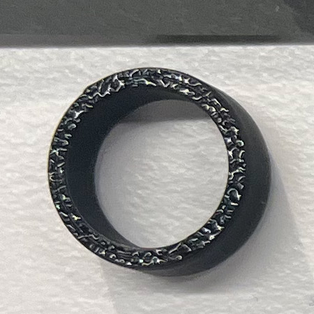 | 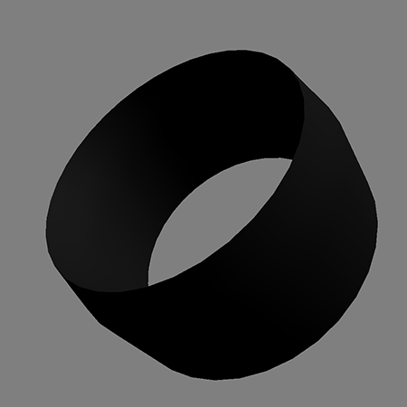 | AC_InCircle.stl | AC_InCircle.step |
| AC Output   | Black/Brown | 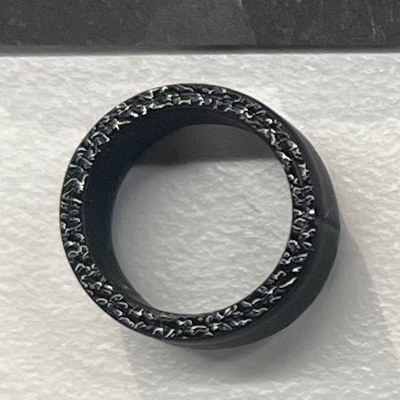 | 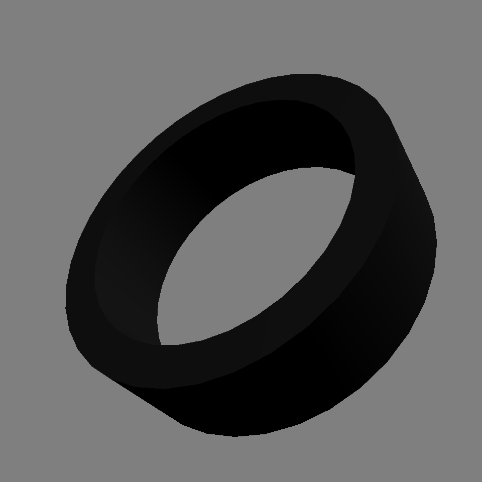 | AC_OutCircle.stl | AC_OutCircle.step |
| DC Input   | Blue/Grey | 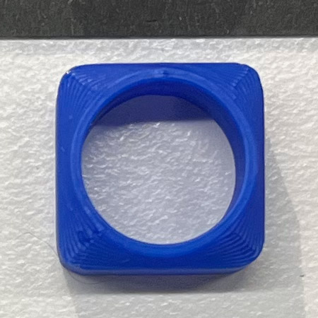 | 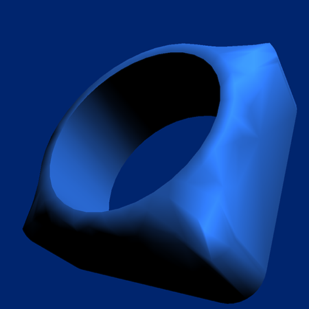 | DC_InSquare.stl | DC_InSquare.step |
| DC Output   | Blue/Grey | 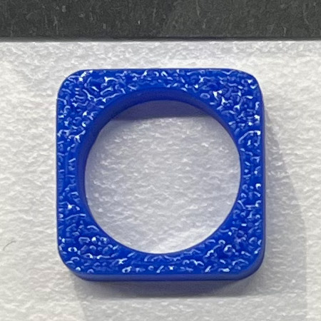 |  | DC_OutSquare.stl | DC_OutSquare.step |
| Pulse Input   | Red | 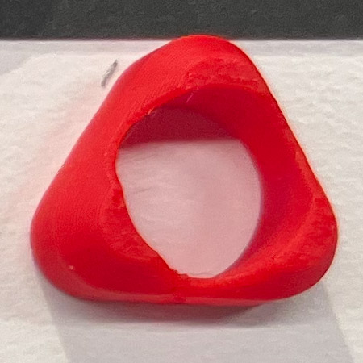 | 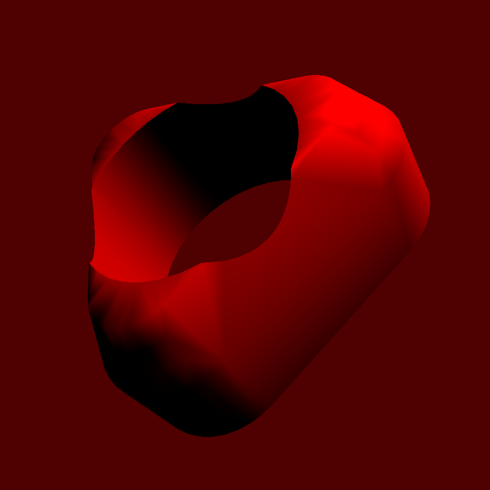 | DC_InSquare.stl | DC_InSquare.step |
| Pulse Output   | Red | 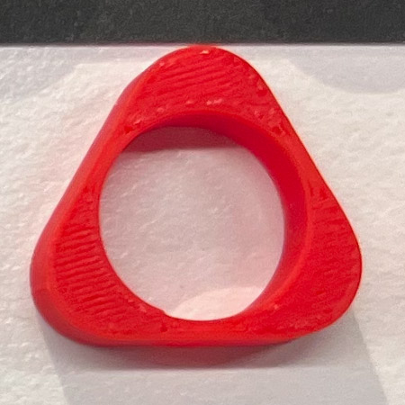 |  | DC_OutSquare.stl | DC_OutSquare.step |
| Misc Input   | Various | 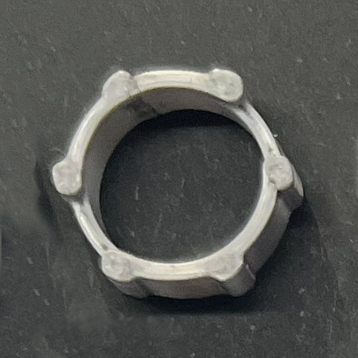 | 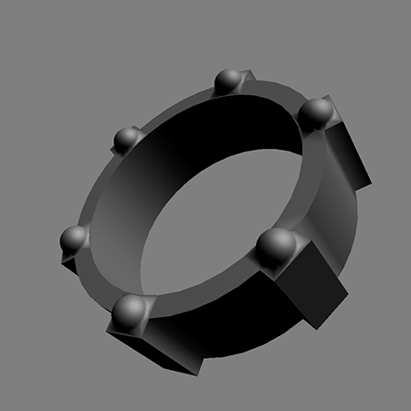 | DC_InSquare.stl | DC_InSquare.step |
| Misc Output   | Various | 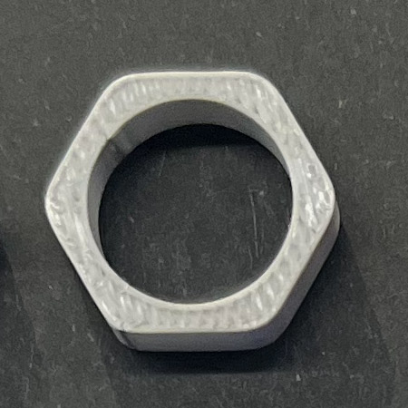 | 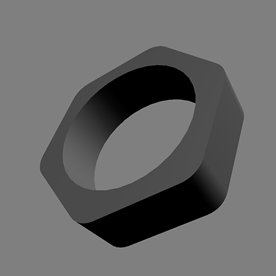 | DC_OutSquare.stl | DC_OutSquare.step |
